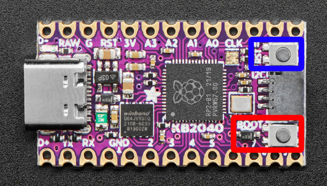
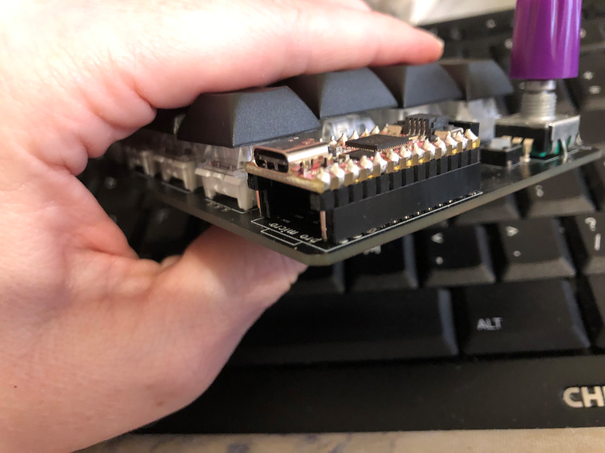
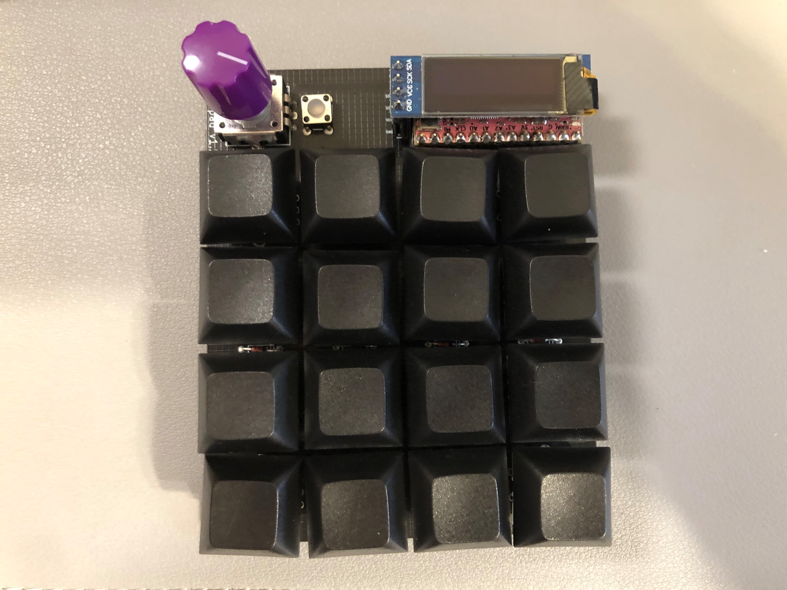
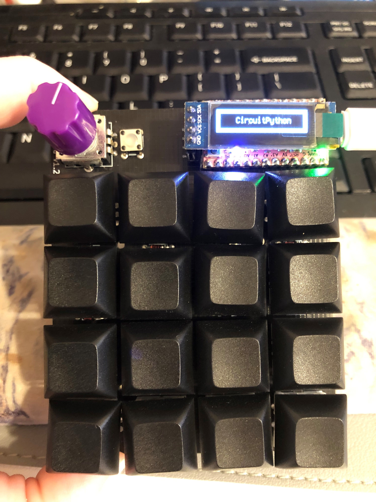

# dumbpad with CircuitPython for the combo_oled!!!

## About the Kee Boar

This is an Arduino Pro Micro-Shaped board made with the beloved RP2040 chip!!!. You can read more about the board in the [adafruit kee boar guide](https://learn.adafruit.com/adafruit-kb2040).

You can purchase the board from adafruit [here](https://www.adafruit.com/product/5302)

## Steps for setup

- Directions taken from the KB2040 guide on the adafruit site... go to their site for more indepth directions. [Adafruit kee boar guide](https://learn.adafruit.com/adafruit-kb2040).

1. Download the latest version of CircuitPython for this board [here](https://circuitpython.org/board/adafruit_kb2040/) It is a UF2 file.

2. To enter the bootloader mode, hold down the BOOT/BOOTSEL button (highlighted in red above), and while continuing to hold it (don't let go!), press and release the reset button (highlighted in blue above). Continue to hold the BOOT/BOOTSEL button until the RPI-RP2 drive appears!

3. You will see a new disk drive appear called RPI-RP2.

4. Drag the adafruit_circuitpython_etc.uf2 file to RPI-RP2.

5. The RPI-RP2 drive will disappear and a new disk drive called CIRCUITPY will appear.

6. Download and Install Mu the recommended CircuitPython Editor. You can find it [here](https://codewith.mu/) Remember to select CircuitPython as the mode.

7. Installing CircuitPython generates a code.py file on your CIRCUITPY drive. To begin your own program, open your editor, and load the code.py file from the CIRCUITPY drive.

If you are using Mu, click the Load button in the button bar, navigate to the CIRCUITPY drive, and choose code.py.

8. Copy and paste the contents of the [code.py](./code.py) file from this repository replace the contents of the code.py file on the CIRCUITPY drive.

9. Download the latest [CircuitPython Library Bundle](https://circuitpython.org/libraries)

10. Drag and drop the required libraries from the bundle to the lib folder on the CIRCUITPY drive. There are some in the lib folder here but they will eventually be out of date so you want to take it from the [latest bundle](https://circuitpython.org/libraries)

11. You should note that there are two extra pins on the KB2040/key boar. Either don't populate them with header or plug it in so they hang off like so:

## Image of the completed project:

## Credit

The CircuitPython code was made possible by adafruit.  They provide tons of example code that you can patch together.  Lots of love for them.